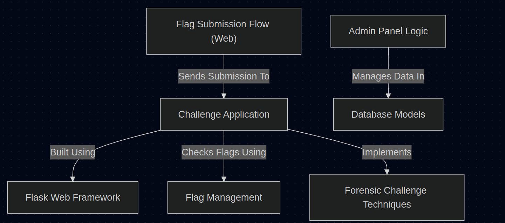

# CTF Platform

<p align="center">
  
</p>

## Overview

This project is a **Capture The Flag (CTF)** platform where users can solve various security challenges. Each challenge is a containerized Flask web application that presents a puzzle requiring users to find a secret flag. The system manages these flags, validates submissions, tracks user progress in a database, and provides an admin panel for competition management.

## Features

- **User Authentication**: Secure login and registration system
- **Challenge Management**: Dynamic loading of challenges from Docker containers
- **Flag Validation**: Unique flags per user with secure submission handling
- **Leaderboard**: Real-time tracking of user progress and points
- **Admin Panel**: Comprehensive tools for managing challenges and users
- **Responsive UI**: Clean interface with celebration effects for solved challenges

## Getting Started

### Prerequisites

- Python 3.8+
- Docker
- SQLite (for development) or PostgreSQL (for production)

### Installation

1. Clone the repository

```bash
git clone https://github.com/yourusername/ctf-platform.git
cd ctf-platform
```

2. Install dependencies

```bash
pip install -r requirements.txt
```

3. Run the application

```bash
python app.py
```

The application will be available at http://localhost:5010

## Documentation

Detailed documentation is available in the [docs](docs/) directory:

| Document | Description |
|----------|-------------|
| [Challenge Application](docs/01_challenge_application.md) | How challenges are structured and containerized |
| [Flag Submission Flow](docs/02_flag_submission_flow__web_.md) | The process of submitting and validating flags |
| [Flag Management](docs/03_flag_management.md) | How flags are generated, stored, and validated |
| [Flask Web Framework](docs/04_flask_web_framework.md) | Overview of the Flask application structure |
| [Database Models](docs/05_database_models.md) | Database schema and relationships |
| [Admin Panel Logic](docs/06_admin_panel_logic.md) | Admin interface functionality |
| [Forensic Challenge Techniques](docs/07_forensic_challenge_techniques.md) | Implementing forensic-type challenges |

## Architecture

The platform uses a microservices architecture where:

1. The main Flask application serves the UI and manages user sessions
2. Each challenge runs in its own Docker container with isolated networking
3. A database stores user data, challenge information, and submission history
4. Background processes manage container lifecycle and cleanup

## Contributing

Contributions are welcome! Please feel free to submit a Pull Request.

1. Fork the repository
2. Create your feature branch (`git checkout -b feature/amazing-feature`)
3. Commit your changes (`git commit -m 'Add some amazing feature'`)
4. Push to the branch (`git push origin feature/amazing-feature`)
5. Open a Pull Request

## License

This project is licensed under the MIT License - see the LICENSE file for details.
