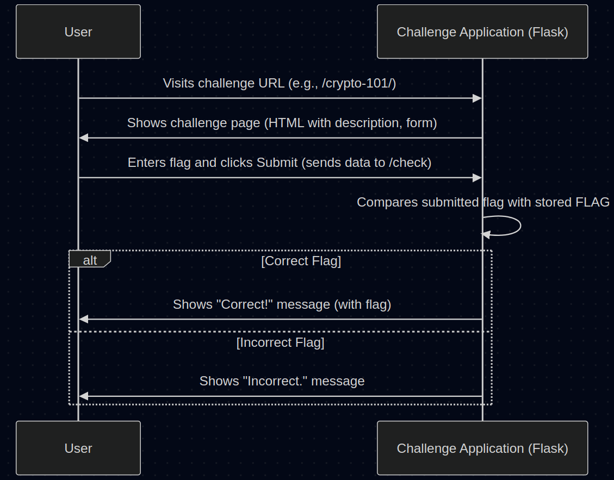

# Chapter 1: Challenge Application

Welcome to the `CTF_Project_Course`! We're excited to have you on board as we build our own Capture The Flag (CTF) platform.

Imagine going to a funfair. Each game booth – the ring toss, the whack-a-mole, the strength tester – is separate. Each has its own rules, its own equipment, and its own prize. Our CTF platform works similarly!

In this chapter, we'll explore the very first core concept: the **Challenge Application**.

## What's a Challenge Application?

Think of each individual CTF challenge in our project (like "Crypto 101" or "Forensics File Carving") as its own mini-website or a small, independent game server. We call this self-contained unit a **Challenge Application**.

**Analogy: The Fair Booth**

It's just like that fair booth:
*   **Presents the Challenge:** It shows you the description, instructions, and maybe some hints (like the rules sign at the booth).
*   **Provides Necessary Files:** If the challenge needs you to download something (like an image file for forensics, or a data file for analysis), the Challenge Application handles that (like the booth giving you the rings for the toss).
*   **Checks Your Answer:** It has a way for you to submit your answer (the "flag") and tells you if you got it right (like the booth operator checking if you won the prize).

**Why Do We Need This?**

Why not just put all challenges into one big website?
*   **Organization:** Keeping each challenge separate makes our project much cleaner and easier to manage.
*   **Independence:** If one challenge application has a bug or needs updating, it doesn't affect the others. They can run independently.
*   **Technology:** Each Challenge Application is built using a simple Python web framework called [Flask Web Framework](04_flask_web_framework.md). We'll learn more about Flask later, but for now, just know it's the tool we use to build these mini-websites.

## Example 1: A Simple Crypto Challenge (`crypto-101`)

Let's look at a simplified version of the code for a basic cryptography challenge. This challenge might ask you to decode a simple encoded message.

```python
# File: challenges/crypto-101/challenge.py (Simplified)

from flask import Flask, request, render_template_string
import base64
import os

# Create the mini-website application
app = Flask(__name__)

# This gets the secret flag for this challenge
# It's like the prize kept securely behind the counter
FLAG = os.environ.get('CTF_FLAG', 'default_flag')

# This is the main page of the challenge ('/')
@app.route('/')
def index():
    # Encode the flag using Base64 (a common encoding)
    encoded_message = base64.b64encode(FLAG.encode()).decode()
    # Show the challenge description and the encoded message
    return render_template_string(f'''
        <h1>Crypto 101 Challenge</h1>
        <p>Decode this message: <code>{encoded_message}</code></p>
        <form action="/check" method="POST">
            <input type="text" name="answer" placeholder="Enter decoded flag">
            <button type="submit">Submit</button>
        </form>
    ''')

# This page handles the submitted answer ('/check')
@app.route('/check', methods=['POST'])
def check():
    # Get the answer the user typed into the form
    submitted_answer = request.form.get('answer', '')

    # Check if the submitted answer matches the real flag
    if submitted_answer == FLAG:
        return f"<h1>Correct!</h1> The flag is: {FLAG}"
    else:
        return "<h1>Incorrect.</h1> <a href='/'>Try again?</a>"

# (Code to run the app is usually here)
```

**Explanation:**

1.  **`app = Flask(__name__)`**: This line creates our mini-website object using Flask.
2.  **`FLAG = os.environ.get(...)`**: This is a secure way to get the secret flag into our application without writing it directly in the code. Think of it as the fair booth operator getting the prize from a locked box.
3.  **`@app.route('/')`**: This tells Flask: "When someone visits the main page (the '/'), run the `index()` function." The `index()` function displays the challenge description and the form.
4.  **`@app.route('/check', methods=['POST'])`**: This tells Flask: "When someone submits the form (sending data via 'POST' to '/check'), run the `check()` function."
5.  **`request.form.get('answer', '')`**: Inside `check()`, this gets the text the user entered in the input field named "answer".
6.  **`if submitted_answer == FLAG:`**: This is the core logic! It compares the user's submission to the actual secret `FLAG`.
7.  **`return "..."`**: Based on the comparison, it sends back a message telling the user if they were right or wrong.

## Example 2: A Forensics Challenge with a File Download (`forensics-carving`)

Some challenges require you to download and analyze a file. Let's look at a simplified `forensics-carving` challenge application.

```python
# File: challenges/forensics-carving/challenge.py (Simplified)

from flask import Flask, request, render_template_string, send_file
import os

# Create the mini-website application
app = Flask(__name__)

# Get the secret flag
FLAG = os.environ.get('CTF_FLAG', 'default_flag')

# --- Helper function to create the challenge file ---
def create_challenge_file(flag_to_hide):
    # In reality, this would create a file with the flag hidden inside
    # For simplicity, we just return the path to a placeholder file
    print(f"Imagine creating a file with '{flag_to_hide}' hidden...")
    file_path = "path/to/generated/challenge.dat" # Placeholder
    # (Code to create the actual file would go here)
    return file_path
# --- End of helper function ---

# Main page ('/') - Shows description and download link
@app.route('/')
def index():
    return render_template_string('''
        <h1>File Carving Challenge</h1>
        <p>Download the file and find the hidden flag.</p>
        <a href="/download">Download Challenge File</a>
        <form action="/check" method="POST">
            <input type="text" name="answer" placeholder="Enter flag">
            <button type="submit">Submit</button>
        </form>
    ''')

# Download route ('/download') - Serves the file
@app.route('/download')
def download_file():
    # 1. Create the specific file for this challenge instance
    file_path = create_challenge_file(FLAG)
    # 2. Send the file to the user's browser for download
    return send_file(file_path, as_attachment=True, download_name="challenge.dat")

# Check route ('/check') - Same logic as before
@app.route('/check', methods=['POST'])
def check():
    submitted_answer = request.form.get('answer', '')
    if submitted_answer == FLAG:
        return f"<h1>Correct!</h1> The flag is: {FLAG}"
    else:
        return "<h1>Incorrect.</h1> <a href='/'>Try again?</a>"

# (Code to run the app is usually here)
```

**What's New?**

*   **`/download` Route:** We added a new page (or "route") specifically for handling file downloads.
*   **`create_challenge_file(...)`:** This function (simplified here) is responsible for generating the unique challenge file that contains the hidden flag.
*   **`send_file(...)`:** This Flask function takes the path to the generated file and sends it to the user's browser, prompting them to save it.

## How It Works: A Simple Flow

When you interact with a Challenge Application, here's a typical sequence of events:

<p align="center">
    
</p>


1.  **Visit:** You open the URL for the specific challenge in your web browser.
2.  **Display:** The Challenge Application (running its Flask code) sends back the HTML page describing the challenge, providing download links (if any), and showing the submission form.
3.  **Submit:** You find the flag (hopefully!) and type it into the form, then click "Submit". Your browser sends the flag data to the application's `/check` URL.
4.  **Check:** The Challenge Application receives your submitted flag. It compares this against the *actual* secret `FLAG` it knows.
5.  **Respond:** The application sends back a new page indicating whether your submission was correct or incorrect.

## Key Takeaways

*   Each CTF challenge runs as its own **Challenge Application**.
*   Think of it like a **mini-website** or a dedicated game booth.
*   It uses the **Flask** web framework.
*   Its job is to **present** the challenge, **provide files** (if needed), and **check** submitted flags.
*   This keeps our overall CTF platform **organized** and **robust**.

## Conclusion

You now understand the fundamental building block of our CTF platform: the Challenge Application. Each one is a small, self-contained Flask application responsible for a single challenge. This modular approach makes development and management much easier.

In the next chapter, we'll look specifically at how the flag submission process works from the user's perspective within the *main* CTF website and how it interacts with these individual Challenge Applications.

Next: [Chapter 2: Flag Submission Flow (Web)](02_flag_submission_flow__web_.md)

