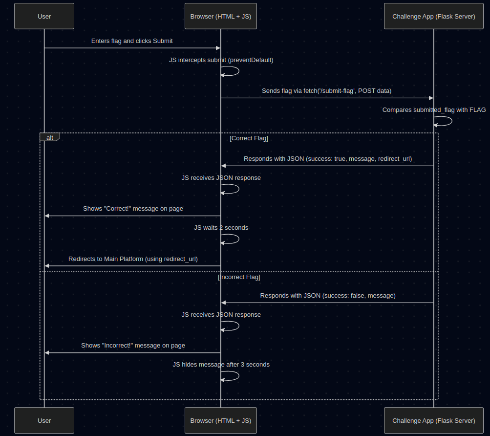

# Chapter 2: Flag Submission Flow (Web)

Welcome back! In [Chapter 1: Challenge Application](01_challenge_application.md), we learned that each CTF challenge runs as its own mini-website, like a separate booth at a funfair. Now, let's zoom in on how you, the player, actually *submit* a flag (your answer) within one of these web-based challenges, specifically the `web-basic` one.

Imagine you've solved the puzzle at a fair booth and won! You need to tell the operator your winning code (the flag). How does that process work smoothly without disrupting your experience? That's what this chapter is about.

## The Goal: Smooth Flag Submission

In older websites, submitting a form often meant the *entire page* had to reload. This could feel slow and clunky. Think about filling out an online form, hitting submit, and having to wait for a whole new page to load just to see if you entered something correctly. Not ideal!

In our `web-basic` challenge (and many modern web applications), we want a better experience:
1.  You find the flag.
2.  You type it into the submission box on the challenge page.
3.  You click "Submit".
4.  You *immediately* get feedback (like "Correct!" or "Incorrect!") right there on the same page, without a full reload.
5.  If you're correct, you're automatically taken back to the main CTF platform after a short pause.

This smooth process uses a combination of standard web technologies: HTML for the form, JavaScript to handle the submission smartly, and the Flask backend (our Challenge Application) to check the answer.

## The Key Ingredients

Let's break down how this works, using the `web-basic` challenge as our example.

### 1. The HTML Form

Everything starts with a standard HTML form where you enter the flag.

```html
<!-- Simplified from challenges/web-basic/challenge.py -->
<div class="flag-form">
    <h3>Submit Flag</h3>
    <!-- The form element -->
    <form id="flag-form">
        <input type="text" id="flag" name="flag" placeholder="Enter flag here" required>
        <button type="submit">Submit Flag</button>
    </form>
    <!-- This empty div will show success/error messages -->
    <div id="message" style="display: none;"></div>
</div>
```

*   **`<form id="flag-form">`**: This defines the form. We give it an `id` ("flag-form") so our JavaScript can easily find it.
*   **`<input type="text" id="flag">`**: This is the text box where you type the flag.
*   **`<button type="submit">`**: The button you click to submit.
*   **`<div id="message">`**: An empty container, initially hidden (`display: none;`). We'll use this later to show feedback messages.

### 2. JavaScript Takes Over

Normally, clicking the submit button would cause the browser to send the form data and load a new page. But we want instant feedback! So, we use JavaScript to *intercept* this submission.

```javascript
// Simplified from challenges/web-basic/challenge.py

// Find the form element using its ID
const form = document.getElementById('flag-form');

// Listen for the 'submit' event on the form
form.addEventListener('submit', function(event) {
    // *** STOP the default browser submission (no page reload!) ***
    event.preventDefault();

    // Get the text the user typed into the input box with id="flag"
    const submittedFlag = document.getElementById('flag').value;

    // (Next step: Send this 'submittedFlag' to the server...)
    console.log("Submitting flag:", submittedFlag);
});
```

*   **`document.getElementById('flag-form')`**: Finds our HTML form.
*   **`addEventListener('submit', ...)`**: Tells the browser, "When this form is submitted, run *my* special function instead of doing the default page reload."
*   **`event.preventDefault()`**: This is the crucial line! It stops the browser's default form submission behaviour.
*   **`document.getElementById('flag').value`**: Gets the actual text (the flag) that the user entered.

### 3. Sending the Flag with `fetch` (AJAX)

Now that JavaScript has the flag and has prevented the page reload, how does it send the flag to the server for checking? It uses a modern JavaScript feature called `fetch`. Think of `fetch` as JavaScript's way of making a quick, behind-the-scenes phone call to the server without hanging up the main conversation (i.e., without reloading the page). This technique is often called AJAX (Asynchronous JavaScript and XML, though we usually use JSON now instead of XML).

```javascript
// Simplified from challenges/web-basic/challenge.py - inside the event listener

// Where to send the flag data on the server
const submitUrl = '/submit-flag';

// Use fetch to send the flag
fetch(submitUrl, {
    method: 'POST', // We are sending data
    headers: {
        'Content-Type': 'application/json' // Tell server we're sending JSON
    },
    // Convert the flag data into JSON format
    body: JSON.stringify({ flag: submittedFlag })
})
.then(response => response.json()) // Expect a JSON response back from server
.then(data => {
    // (Next step: Handle the server's response 'data'...)
    console.log("Server responded:", data);
});
```

*   **`fetch(submitUrl, ...)`**: Initiates the request to the `/submit-flag` path on our Challenge Application server.
*   **`method: 'POST'`**: We use POST because we are *sending* data to the server.
*   **`headers: {'Content-Type': 'application/json'}`**: Tells the server we are sending the data in JSON format.
*   **`body: JSON.stringify({ flag: submittedFlag })`**: Packages the flag into a standard JSON string like `{"flag": "user_entered_flag_here"}`.
*   **`.then(response => response.json())`**: Waits for the server's response and parses it as JSON.
*   **`.then(data => { ... })`**: This part runs *after* the server has responded and the response has been parsed. The `data` variable holds the server's reply (e.g., `{ "success": true, "message": "Correct!" }`).

### 4. The Server Checks the Flag

The Challenge Application (our Flask app) needs a route to handle these `fetch` requests coming to `/submit-flag`.

```python
# Simplified from challenges/web-basic/challenge.py
from flask import Flask, request, jsonify
import os

app = Flask(__name__)
FLAG = os.environ.get('CTF_FLAG', 'actual_secret_flag') # The correct flag
MAIN_SITE = os.environ.get('MAIN_SITE', 'http://localhost:5010') # Main CTF platform URL

# This function handles requests to '/submit-flag'
@app.route('/submit-flag', methods=['POST'])
def submit_flag_route():
    # Get the JSON data sent by the JavaScript 'fetch'
    data = request.get_json()
    submitted_flag = data.get('flag', '')

    # Compare the submitted flag with the real flag
    if submitted_flag == FLAG:
        # Correct! Prepare a success response
        response_data = {
            "success": True,
            "message": "Correct! Redirecting...",
            # Tell the JS where to redirect
            "redirect_url": f"{MAIN_SITE}?flag_success=true&challenge=web-basic"
        }
    else:
        # Incorrect! Prepare an error response
        response_data = {
            "success": False,
            "message": "Incorrect flag. Try again!"
        }

    # Send the response back to the browser as JSON
    return jsonify(response_data)

# (Other routes like '/' and code to run the app omitted for brevity)
```

*   **`@app.route('/submit-flag', methods=['POST'])`**: Defines the server-side endpoint that listens for POST requests at `/submit-flag`.
*   **`request.get_json()`**: Flask automatically parses the incoming JSON data sent by `fetch`.
*   **`data.get('flag', '')`**: Safely extracts the submitted flag value from the parsed JSON.
*   **`if submitted_flag == FLAG:`**: The core check!
*   **`jsonify(response_data)`**: Flask converts the Python dictionary (`response_data`) into a proper JSON response to send back to the browser's JavaScript. Notice how it includes `success` status, a `message`, and crucially, the `redirect_url` if the flag is correct.

### 5. JavaScript Shows Feedback and Redirects

Finally, the JavaScript code that called `fetch` receives the JSON response from the server and acts accordingly.

```javascript
// Simplified from challenges/web-basic/challenge.py - the second .then() block

.then(data => {
    // 'data' is the JSON object from the server { success: ..., message: ... }
    console.log("Server responded:", data);

    const messageDiv = document.getElementById('message');

    // Update the message div based on the 'success' field
    messageDiv.textContent = data.message;
    messageDiv.className = data.success ? 'message success' : 'message error';
    messageDiv.style.display = 'block'; // Make the message visible

    if (data.success) {
        // If correct, wait 2 seconds then redirect
        setTimeout(function() {
            window.location.href = data.redirect_url; // Use the URL from server
        }, 2000); // 2000 milliseconds = 2 seconds
    } else {
        // If incorrect, hide the message after 3 seconds
        setTimeout(function() {
            messageDiv.style.display = 'none';
        }, 3000);
    }
});
// Add a .catch block for network errors (good practice!)
.catch(error => {
    console.error("Error submitting flag:", error);
    const messageDiv = document.getElementById('message');
    messageDiv.textContent = 'Error communicating with server.';
    messageDiv.className = 'message error';
    messageDiv.style.display = 'block';
});
```

*   **`messageDiv.textContent = data.message;`**: Sets the text inside the `#message` div to the message received from the server.
*   **`messageDiv.className = ...`**: Changes the appearance (using CSS classes like `success` or `error`) based on whether `data.success` was true or false.
*   **`messageDiv.style.display = 'block';`**: Makes the message div visible on the page.
*   **`if (data.success)`**: Checks the server's response.
*   **`setTimeout(...)`**: Used to add a short delay.
*   **`window.location.href = data.redirect_url;`**: If the flag was correct, this line performs the magic! It tells the browser to navigate to the new URL (provided by the server in the `redirect_url` field), taking the user back to the main platform.
*   **`.catch(error => ...)`**: Handles potential problems like network issues where the `fetch` call couldn't even reach the server.

## The Flow in Action

Let's visualize the entire process:

<p align="center">
    
</p>


1.  **Submit:** User enters flag, clicks button.
2.  **Intercept:** JavaScript stops the normal page reload.
3.  **Send:** JavaScript uses `fetch` to send the flag to the `/submit-flag` endpoint on the Challenge Application server.
4.  **Check:** The Flask server receives the flag, compares it to the correct one.
5.  **Respond:** Flask sends back a JSON message indicating success or failure. If successful, it includes the URL to redirect back to the main CTF platform.
6.  **Feedback:** JavaScript receives the JSON, shows the appropriate message (success/error) in the `#message` div *on the current page*.
7.  **Redirect (on Success):** If the flag was correct, JavaScript waits a couple of seconds (so the user can see the success message) and then redirects the browser to the main platform URL.

This AJAX approach provides instant feedback without jarring page reloads, making the experience much smoother for the player. The redirect ensures that once a challenge is solved, the user is seamlessly returned to the main platform, likely to see their updated score or choose the next challenge. This interaction with the main platform is related to [Flag Management](03_flag_management.md), which we'll cover next.

## Conclusion

You've now seen how a modern web flag submission works! Instead of clunky page reloads, we use JavaScript's `fetch` command to send the flag to the Challenge Application's backend (Flask) behind the scenes. The backend checks the flag and sends back a simple JSON response. JavaScript then uses this response to instantly update the page with feedback and, if the flag is correct, smoothly redirects the user back to the main CTF platform. This AJAX-based flow is key to providing a responsive and enjoyable user experience in web challenges.

Next up, we'll look at how flags are managed more broadly within the entire CTF system, including how the main platform knows which flags belong to which challenges and how points are awarded.

Next: [Chapter 3: Flag Management](03_flag_management.md)

