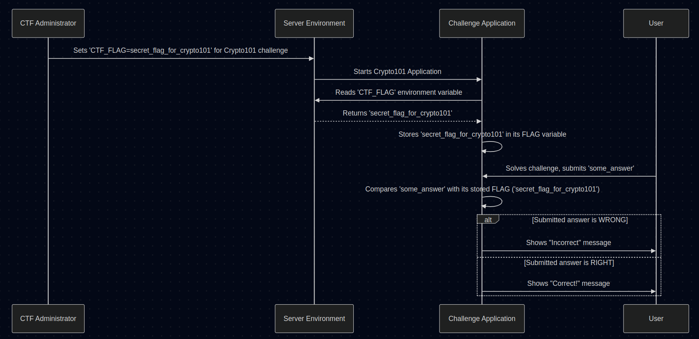

# Chapter 3: Flag Management

In [Chapter 2: Flag Submission Flow (Web)](02_flag_submission_flow__web_.md), we saw how a player submits their answer (the flag) using a web form and how JavaScript sends it smoothly to the Challenge Application without a full page reload. But how does the Challenge Application *know* what the correct answer is? And how does it keep that answer safe?

That's where **Flag Management** comes in. It's all about handling the secret answer – the "flag" – for each challenge.

## What is a Flag, Really?

In Capture The Flag (CTF) competitions, the "flag" is simply the secret string of text you are trying to find. It proves you solved the challenge. It could look like `flag{this_is_a_secret_message}` or just be a specific word or code.

**Analogy: The Treasure Chest Key**
Think of solving a challenge like finding a hidden treasure chest. The flag is the unique key that unlocks that chest. Your goal is to find the key.

## The Problem: Where to Keep the Key?

Imagine you're building a treasure hunt game. You have many chests (challenges), and each needs a unique key (flag). Where do you store the *correct* key for each chest so the game can check if a player found the right one?

You definitely *wouldn't* want to:
*   Leave the key sitting right next to the chest (like writing the flag directly in the challenge description!).
*   Write the key on a piece of paper visible to everyone (like hardcoding the flag directly inside the challenge application's *public* code).

Why? Because players could easily find the answer without actually solving the puzzle! We need a secure place to store the correct flag for each challenge.

## Secure Storage: Environment Variables

In our project, each [Challenge Application](01_challenge_application.md) runs independently. We need a way to give each application its *own* secret flag without writing it directly into the Python code that gets shared or deployed.

A common and secure way to do this is using **Environment Variables**.

**Analogy: The Secret Instruction Slip**
Imagine when you start the fair booth game (run the Challenge Application), someone secretly slips the booth operator (the application) a small, hidden note. This note tells the operator what the winning prize code (the flag) is for *that specific game session*. This note isn't visible to the players.

Environment variables work like that secret note. They are values set *outside* the application code, in the environment where the application runs (like the server or container). The application can then *read* these values when it starts.

In our code (like in `challenges/crypto-101/challenge.py`), you saw this line:

```python
# File: challenges/crypto-101/challenge.py (Snippet)
import os

# Read the value of the environment variable named 'CTF_FLAG'
# If 'CTF_FLAG' isn't set, use 'default_flag...' as a fallback.
FLAG = os.environ.get('CTF_FLAG', 'default_flag_please_set_env_variable')

# Now, the variable 'FLAG' holds the secret value.
```

*   `import os`: This line imports Python's built-in 'os' module, which lets us interact with the operating system, including environment variables.
*   `os.environ`: This is like a dictionary containing all the environment variables available to the application.
*   `.get('CTF_FLAG', ...)`: This tries to retrieve the value associated with the key `'CTF_FLAG'`. The second part (`'default_flag...'`) is a default value to use if `CTF_FLAG` doesn't exist (which shouldn't happen in a properly configured setup).

When we run a challenge container (using tools like Docker, which we'll touch on later), we can specifically set the `CTF_FLAG` environment variable for *that* container. This way, each challenge instance securely gets its correct flag.

## Checking the Submission: The Lock Mechanism

Now that the Challenge Application securely knows the correct flag (stored in its `FLAG` variable), how does it check the player's submission?

This is the straightforward part we saw in previous chapters. It's a simple comparison.

**Analogy: Trying the Key**
The player brings a key (their submitted answer) to the treasure chest (the `/check` or `/submit-flag` route). The chest has a lock mechanism (the checking code) that only opens if the key matches the *correct* key (the one stored secretly).

```python
# File: challenges/crypto-101/challenge.py (Snippet - /check route)

@app.route('/check', methods=['POST'])
def check():
    # 1. Get the key the player submitted
    submitted_answer = request.form.get('answer', '')

    # 2. Compare it to the correct key (from the environment variable)
    if submitted_answer == FLAG:
        # 3a. It matches! Unlock the chest (show success)
        return f"<h1>Correct!</h1> The flag is: {FLAG}"
    else:
        # 3b. Doesn't match. Keep the chest locked (show failure)
        return "<h1>Incorrect.</h1> <a href='/'>Try again?</a>"

```

*   `request.form.get('answer', '')`: Gets the player's submitted flag from the web form.
*   `if submitted_answer == FLAG:`: This is the core check! It compares the player's input directly against the secret flag value read from the environment variable.

## The Flag Management Flow

Let's visualize how setting the flag and checking it works:

<p align="center">
    
</p>


1.  **Setup:** An administrator (or an automated system) configures the server environment where the Challenge Application will run, setting the `CTF_FLAG` environment variable specifically for that challenge.
2.  **Startup:** The Challenge Application starts.
3.  **Read Secret:** The application code (`os.environ.get('CTF_FLAG', ...)`) reads the value of `CTF_FLAG` from its environment and stores it internally (e.g., in a variable named `FLAG`).
4.  **User Submits:** A user interacts with the challenge and submits an answer.
5.  **Check:** The application code compares the user's submitted answer against the secret `FLAG` value it read during startup.
6.  **Respond:** The application tells the user if they were right or wrong.

## Connecting to the Main Platform (A Sneak Peek)

You might wonder: if each challenge has its flag stored in an environment variable, how does the *main* CTF platform know all the flags? How does it award points centrally?

That's a great question! While each Challenge Application only needs to know its *own* flag, the main platform relies on a central source of truth. This usually involves:

1.  **Central Storage:** Flags (along with challenge names, points, descriptions, etc.) are stored in a central database. We'll explore this in [Chapter 5: Database Models](05_database_models.md).
2.  **Configuration:** When a challenge container is launched (like our mini-websites), the main platform (or deployment system) reads the correct flag from the database.
3.  **Injection:** This flag is then "injected" into the challenge container's environment as the `CTF_FLAG` environment variable.
4.  **Verification:** When a user submits a flag (as seen in Chapter 2), the Challenge Application verifies it. If correct, it might redirect the user back to the main platform with a success message, potentially including the challenge identifier. The main platform then confirms the solve and awards points based on its database records. The logic for managing challenges from the main platform perspective is covered in [Chapter 6: Admin Panel Logic](06_admin_panel_logic.md).

For now, the key takeaway is that each Challenge Application securely receives its flag via environment variables and uses it to check submissions independently.

## Conclusion

Flag management is crucial for any CTF. You've learned:
*   The "flag" is the secret answer to a challenge.
*   Storing flags securely is vital – we don't put them directly in public code.
*   **Environment variables** (like `CTF_FLAG`) are a common way to securely pass the correct flag to an individual Challenge Application.
*   The application reads this environment variable at startup (`os.environ.get`).
*   It then uses this stored flag value to check against user submissions (`if submitted_answer == FLAG:`).

This simple but secure mechanism ensures that each challenge knows its own secret and can verify player attempts correctly, just like a lock only opens with the right key.

In the next chapter, we'll dive deeper into the web framework used to build these Challenge Applications: Flask.

Next: [Chapter 4: Flask Web Framework](04_flask_web_framework.md)

