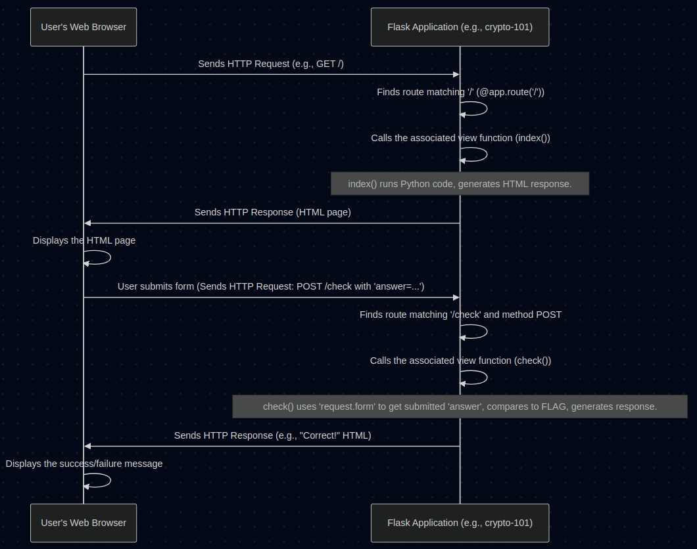

# Chapter 4: Flask Web Framework

Welcome back! In [Chapter 3: Flag Management](03_flag_management.md), we learned how each Challenge Application securely gets its secret flag using environment variables and checks player submissions. But how do we actually build the mini-website part of the Challenge Application? How does it receive clicks and form submissions from a user's browser and send back web pages or messages?

That's where the **Flask Web Framework** comes in. It's the tool we use to build the interactive web component of almost every challenge in our CTF project.

## What Problem Does Flask Solve? Building Mini-Websites!

Imagine you want to create a simple webpage that:
1.  Shows a user a question (like our `crypto-101` challenge asking to decode a message).
2.  Provides a box for the user to type their answer.
3.  Checks if the answer is correct when the user clicks "Submit".
4.  Shows a "Correct!" or "Incorrect." message back to the user.

Doing this from scratch involves understanding complex web protocols (like HTTP), handling incoming connections, parsing user input, and formatting responses correctly for browsers. It's a lot of repetitive work!

Flask simplifies all of this. It provides building blocks and handles the low-level web communication, letting us focus on the unique logic of our challenge (like encoding/decoding messages or checking flags).

**Analogy: The Car Engine and Chassis**

Think of building a car. You *could* start by mining metal ore and figuring out how to make pistons and wheels yourself. Or, you could start with a pre-built chassis and engine. Flask is like that chassis and engine:
*   **Chassis:** Provides the basic structure for our web application.
*   **Engine:** Handles the power of receiving requests and sending responses.

We just need to add the car body, seats, and steering wheel (our specific challenge logic and HTML).

## What is Flask?

Flask is a **microframework** for Python.
*   **Framework:** A collection of tools and libraries that provide a structure for building applications.
*   **Micro:** It means Flask is intentionally small and simple. It provides the basics for web development but doesn't force you into complex structures you might not need, especially for our small Challenge Applications.
*   **Python:** It's written in Python, making it easy to integrate with other Python code.

Flask's main job is to map incoming web requests (like someone visiting a URL) to specific Python functions that generate a response (like an HTML page).

## Key Flask Concepts

Let's look at the essential parts of a Flask application, using our simplified `crypto-101` example.

```python
# Simplified from challenges/crypto-101/challenge.py

# 1. Import Flask and necessary tools
from flask import Flask, request, render_template_string
import base64
import os

# 2. Create the Flask Application Instance
app = Flask(__name__)

# Secret flag (from Chapter 3)
FLAG = os.environ.get('CTF_FLAG', 'default_flag')

# 3. Define a Route and its View Function (for the main page)
@app.route('/')
def index():
    # This function runs when someone visits the main URL ('/')
    encoded_message = base64.b64encode(FLAG.encode()).decode()
    # 4. Return a Response (HTML page)
    return render_template_string(f'''
        <h1>Crypto 101 Challenge</h1>
        <p>Decode this message: <code>{encoded_message}</code></p>
        <form action="/check" method="POST">
            <input type="text" name="answer">
            <button type="submit">Submit</button>
        </form>
    ''')

# 3. Define another Route and View Function (for checking the answer)
@app.route('/check', methods=['POST'])
def check():
    # This function runs when the form is submitted to '/check'
    # 5. Access Incoming Request Data
    submitted_answer = request.form.get('answer', '')

    # Check the flag (from Chapter 3)
    if submitted_answer == FLAG:
        # 4. Return a Response (Success message)
        return f"<h1>Correct!</h1> The flag is: {FLAG}"
    else:
        # 4. Return a Response (Failure message)
        return "<h1>Incorrect.</h1> <a href='/'>Try again?</a>"

# (Code to run the app is usually here: app.run(...))
```

Let's break down the numbered parts:

1.  **Import Flask:** `from flask import Flask, ...` We need to bring the Flask tools into our Python script. `request` lets us access incoming data, and `render_template_string` helps create HTML easily.
2.  **Create Application Instance:** `app = Flask(__name__)` This line creates the main object that represents our mini-website. Think of it as turning on the engine. `__name__` is a special Python variable that Flask uses to find resources.
3.  **Routes (`@app.route(...)`) and View Functions (`def index():`, `def check():`)**:
    *   `@app.route('/')`: This is a Python "decorator". It tells Flask: "When a web browser asks for the main page (the path `/`), execute the function defined right below this line (`index()`)."
    *   `@app.route('/check', methods=['POST'])`: This tells Flask: "When a browser sends data using the POST method (typically from a form submission) to the path `/check`, execute the `check()` function."
    *   `def index():` and `def check():`: These are called **view functions**. They contain the Python logic that runs for a specific route. They "handle the view" for that URL.
4.  **Returning Responses:** Each view function must `return` something that Flask can send back to the browser. This could be:
    *   A simple string of text or HTML (like in `check()`).
    *   HTML generated using `render_template_string()` (like in `index()`). This function is handy for mixing Python variables into HTML.
    *   JSON data using `jsonify()` (seen in [Chapter 2: Flag Submission Flow (Web)](02_flag_submission_flow__web_.md)).
    *   A file using `send_file()` (seen in the forensics challenge in [Chapter 1: Challenge Application](01_challenge_application.md)).
5.  **Accessing Request Data (`request`)**: When a user submits a form, how does our `check()` function get the answer they typed? Flask makes the incoming data available through the global `request` object.
    *   `request.form.get('answer', '')`: This specifically looks for data sent via a form submission (POST request) and tries to get the value associated with the input field named `"answer"`.

So, Flask provides the `@app.route` mechanism to connect URLs to Python functions, and gives those functions access to incoming data (`request`) and ways to send back responses (`return`).

## How it Works: The Request-Response Cycle

When you interact with a Flask-based Challenge Application, here's the typical flow:

<p align="center">
    
</p>


1.  **Request:** Your browser sends an HTTP request to the challenge's URL (e.g., `http://challenge-address/`).
2.  **Routing:** Flask receives the request and looks at the URL path (`/`) and method (`GET`). It checks its list of `@app.route` definitions to find a match.
3.  **View Function Execution:** Flask finds the matching route (`@app.route('/')`) and calls the corresponding view function (`index()`).
4.  **Processing:** The `index()` function runs its Python code. It might generate HTML, fetch data, or perform calculations. In our example, it encodes the flag and creates an HTML string.
5.  **Response:** The `index()` function returns the HTML string.
6.  **Sending Back:** Flask takes the returned value, packages it into a proper HTTP response, and sends it back to your browser.
7.  **Display:** Your browser receives the HTTP response and renders the HTML page.

The same cycle happens when you submit the form, but this time the request goes to `/check` with the `POST` method, and the `check()` function is executed.

## Flask in Our Project

As seen in the code snippets at the end of [Chapter 3: Flag Management](03_flag_management.md), almost every `challenge.py` file in the `challenges/` directory follows this basic Flask pattern:
*   Import `Flask` and other needed tools.
*   Create the `app = Flask(__name__)` instance.
*   Define routes (`@app.route`) for displaying the challenge (`/`), handling submissions (`/check` or `/submit-flag`), and potentially downloading files (`/download`, `/image`).
*   Implement the view functions for each route, containing the specific logic for that challenge.
*   Use `request` to get user input and `return` appropriate responses.

Flask provides the essential web server capabilities for each isolated [Challenge Application](01_challenge_application.md).

## Conclusion

You now understand the role of Flask as the web framework powering our individual CTF challenges. It acts like the engine and chassis, handling the complexities of web communication (requests and responses) so we can focus on writing the Python logic for each challenge.

Key takeaways:
*   Flask is a Python microframework for building web applications.
*   It uses **routes** (`@app.route`) to map URLs to Python **view functions**.
*   View functions use the `request` object to access incoming data.
*   View functions `return` responses (HTML, text, JSON, files) to be sent back to the user's browser.
*   Each Challenge Application in our project is a small, independent Flask app.

While Flask handles the web interactions within a single challenge, how does the main CTF platform keep track of *all* challenges, user scores, and submitted flags centrally? Often, this requires storing data persistently, which leads us to our next topic: databases.

Next: [Chapter 5: Database Models](05_database_models.md)

