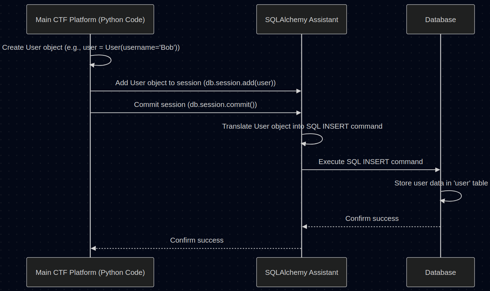

# Chapter 5: Database Models

Welcome back! In [Chapter 4: Flask Web Framework](04_flask_web_framework.md), we saw how Flask helps us build the mini-websites for each individual challenge, handling web requests and responses. But what about the main CTF platform itself? How does it remember who the players are, what challenges exist, who solved what, and everyone's scores? Flask applications, by default, forget everything when they restart! We need a way to store information permanently.

That's where **Database Models** come in.

## The Problem: Remembering Everything

Imagine you're organizing a big CTF event. You have players signing up, challenges being added, players submitting flags, and scores changing all the time. How do you keep track of all this information reliably?

*   You can't just keep it in the computer's memory, because if the server restarts, all that information is lost!
*   Writing everything to simple text files would quickly become messy and hard to search through.

You need an organized system, like a set of well-labelled filing cabinets, to store and retrieve information efficiently and permanently. In the world of web applications, these "filing cabinets" are **databases**.

But how do we tell the database exactly *what kind* of information goes into each drawer and *how* it should be structured? We need blueprints!

## Database Models: The Blueprints for Your Data

**Database Models** are essentially **blueprints** that define the structure of the information our main CTF platform needs to remember. They describe *what* pieces of data we need for each "thing" (like a user or a challenge) and what type of data each piece is (e.g., text, number, date).

**Analogy: Filing Cabinet Forms**

Think back to the filing cabinet. Before you put information into a drawer (a database table), you usually have a standard form to fill out.
*   For a new **Player**, the form might have fields for "Username", "Email", "Password", "Points".
*   For a new **Challenge**, the form might have fields for "Challenge Name", "Description", "Category", "Points".
*   For a **Submission**, the form might need "Who Submitted?", "Which Challenge?", "What Flag Was Tried?", "Was it Correct?", "When?".

These forms ensure that all information for a specific type of item is stored consistently. Our Database Models act exactly like these forms, but defined in code.

## SQLAlchemy: Our Blueprint Designer and Filing Assistant

How do we create these blueprints in our Python-based Flask application? We use a powerful tool called **SQLAlchemy**. Specifically, we often use `Flask-SQLAlchemy`, which integrates it nicely with Flask.

**Analogy:** If the database is the filing cabinet, and the Models are the forms, then SQLAlchemy is like a combination of:
1.  **Form Designer:** It helps us define the structure of our forms (Models) using Python code.
2.  **Filing Assistant:** It takes our completed forms (Python objects) and handles the process of putting them into the correct drawers (database tables) and retrieving them later. It speaks the language of the database (SQL) so we don't have to write it ourselves most of the time.

## Defining Our Blueprints: Key Models

Let's look at simplified blueprints (Models) for the core information our CTF platform needs. These are usually defined in a file like `models.py`.

*(Note: These are simplified versions of the code provided in the context.)*

### 1. The `User` Model (Player Information)

We need to store details about each player.

```python
# Simplified from models.py
from flask_sqlalchemy import SQLAlchemy
from datetime import datetime
# Assume 'db' is our SQLAlchemy assistant, initialized elsewhere
db = SQLAlchemy()

class User(db.Model):
    id = db.Column(db.Integer, primary_key=True) # Unique ID for each user
    username = db.Column(db.String(80), unique=True, nullable=False) # Username must be unique
    password_hash = db.Column(db.String(128), nullable=False) # Store hashed password, never plain text!
    points = db.Column(db.Integer, default=0) # Player's score, starts at 0
    # ... other fields like email, created_at ...

    # Function to securely store password (simplified)
    def set_password(self, password):
        # In reality, uses secure hashing like werkzeug.security.generate_password_hash
        print(f"Hashing '{password}' and storing it...")
        self.password_hash = f"hashed_{password}" # NEVER store plain text!

    # Function to check submitted password (simplified)
    def check_password(self, password):
        # In reality, uses secure checking like werkzeug.security.check_password_hash
        print(f"Checking if '{password}' matches the stored hash...")
        return self.password_hash == f"hashed_{password}"

    def __repr__(self): # Helps in debugging
        return f'<User {self.username}>'
```

*   **`class User(db.Model):`**: Defines the blueprint for Users. It inherits from `db.Model`, which gives it SQLAlchemy powers.
*   **`id = db.Column(...)`**: Defines a field named `id`. `db.Integer` means it's a whole number. `primary_key=True` means this `id` uniquely identifies each user in the database table.
*   **`username = db.Column(...)`**: Defines the `username` field. `db.String(80)` means it's text, up to 80 characters. `unique=True` ensures no two users have the same username. `nullable=False` means this field cannot be empty.
*   **`password_hash = db.Column(...)`**: Stores the *hashed* version of the password. We **never** store actual passwords! Functions like `set_password` and `check_password` handle the secure hashing and verification (using libraries like `werkzeug.security`).
*   **`points = db.Column(...)`**: Stores the user's score as an integer, defaulting to 0.

### 2. The `Challenge` Model (Challenge Information)

We need to store details about each CTF challenge.

```python
# Simplified from models.py
class Challenge(db.Model):
    id = db.Column(db.Integer, primary_key=True) # Unique ID for each challenge
    name = db.Column(db.String(100), nullable=False) # Challenge title
    description = db.Column(db.Text, nullable=False) # Longer text description
    points = db.Column(db.Integer, nullable=False) # How many points it's worth
    category = db.Column(db.String(50), nullable=False) # e.g., 'Web', 'Crypto', 'Forensics'
    challenge_id = db.Column(db.String(50), unique=True, nullable=False) # Like 'web-basic', 'crypto-101'
    # ... other fields like is_active, created_at ...

    def __repr__(self):
        return f'<Challenge {self.name}>'
```

*   This defines the structure for storing information about each challenge, like its name, description, points value, and a unique identifier (`challenge_id`) that might correspond to the challenge application's folder name.

### 3. The `Submission` Model (Tracking Attempts)

We need to remember every time a user tries to submit a flag.

```python
# Simplified from models.py
class Submission(db.Model):
    id = db.Column(db.Integer, primary_key=True) # Unique ID for this submission attempt
    user_id = db.Column(db.Integer, db.ForeignKey('user.id'), nullable=False) # Which user submitted?
    challenge_id = db.Column(db.Integer, db.ForeignKey('challenge.id'), nullable=False) # For which challenge?
    flag = db.Column(db.String(200), nullable=False) # What flag did they enter?
    is_correct = db.Column(db.Boolean, nullable=False) # Was the flag correct? (True/False)
    submitted_at = db.Column(db.DateTime, default=datetime.utcnow) # When was it submitted?

    # Link back to the User and Challenge objects (Relationships)
    user = db.relationship('User', backref='submissions')
    challenge = db.relationship('Challenge', backref='submissions')

    def __repr__(self):
        correctness = "Correct" if self.is_correct else "Incorrect"
        return f'<Submission by User {self.user_id} for Challenge {self.challenge_id} ({correctness})>'
```

*   This model stores a record of each flag submission.
*   **`db.ForeignKey('user.id')`**: This is crucial! It links the `user_id` field in the `Submission` table to the `id` field in the `User` table. It tells the database, "This submission belongs to *that specific* user." Similarly for `challenge_id`.
*   **`db.relationship(...)`**: This is an SQLAlchemy feature that makes it easy to access the linked objects directly in Python. For example, if you have a `Submission` object called `sub`, you can get the corresponding `User` object by accessing `sub.user`.

## How It Works: Saving and Retrieving Data

So we have these blueprints (Models). How does the platform actually use them with SQLAlchemy to save and get data from the database?

**Analogy: Using the Filing Assistant**

1.  **Fill Out Form:** When a new user registers, the platform code creates a `User` object in Python and fills in its details (username, hashed password, etc.). This is like filling out the "New Player" form.
    ```python
    # Example: Creating a new User object
    new_player = User(username='Alice', points=0)
    new_player.set_password('supersecret') # This hashes the password
    ```
2.  **Give Form to Assistant:** The platform gives this filled `new_player` object to SQLAlchemy's "session" (think of it as an inbox or temporary holding area).
    ```python
    # Example: Adding the object to the session
    db.session.add(new_player)
    ```
3.  **Assistant Files It:** The platform tells the assistant to "commit" the changes. SQLAlchemy then generates the necessary database commands (SQL `INSERT` statement) and sends them to the database to permanently store the new user's information in the `user` table.
    ```python
    # Example: Saving changes to the database
    db.session.commit()
    ```

Retrieving data works similarly: you ask SQLAlchemy to find a user (e.g., by username), and it fetches the data from the database and gives you back a `User` object.

**Simplified Flow: Saving a New User**

<p align="center">
    
</p>


## Connecting Everything

These database models form the backbone of the main CTF platform.
*   When you log in, the platform creates a `User` object from the database matching your username and uses `check_password` to verify your credentials.
*   When you view the challenges page, the platform queries the database (via SQLAlchemy) for all `Challenge` objects marked as active.
*   When you submit a correct flag and get redirected back, the main platform records a `Submission` object, updates your `User` object's `points`, and saves these changes to the database.
*   The scoreboard is generated by querying `User` objects and ordering them by points.
*   The [Admin Panel Logic](06_admin_panel_logic.md) heavily uses these models to add/edit challenges, view submissions, and manage users.

## Conclusion

You've now learned about Database Models – the essential blueprints that define how our main CTF platform structures and stores persistent information like user accounts, challenges, and submissions.

Key takeaways:
*   We need databases to store platform data permanently.
*   **Database Models** are Python classes (using SQLAlchemy's `db.Model`) that act as blueprints for database tables.
*   **SQLAlchemy** is the tool (our "filing assistant") that helps us define these models and interact with the database (saving and retrieving data) using Python objects instead of raw SQL.
*   Key models include `User`, `Challenge`, and `Submission`.
*   **Foreign Keys** (`db.ForeignKey`) and **Relationships** (`db.relationship`) link related models together (e.g., linking a Submission to its User and Challenge).

These models provide the organized structure needed to manage all the data for the entire CTF competition. Next, we'll see how administrators interact with this data through the admin panel.

Next: [Chapter 6: Admin Panel Logic](06_admin_panel_logic.md)

