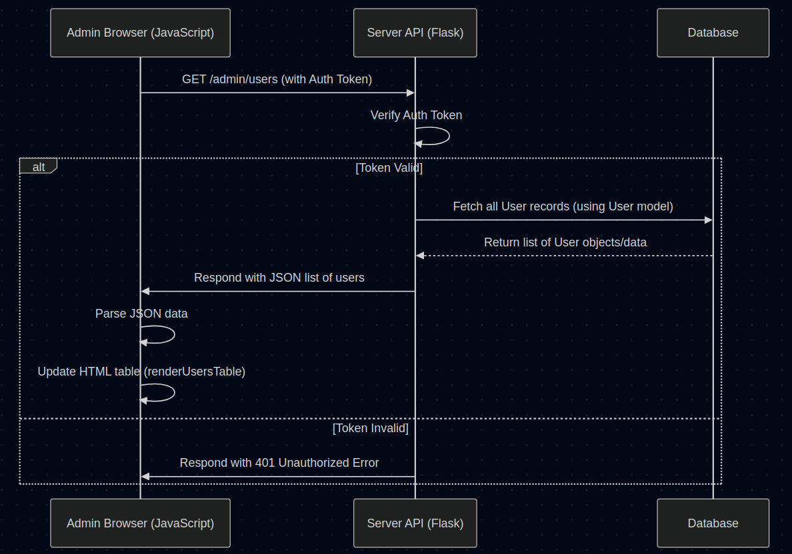

# Chapter 6: Admin Panel Logic

Welcome back! In [Chapter 5: Database Models](05_database_models.md), we learned how the main CTF platform uses blueprints (models) to store important information like users, challenges, and submissions in a database. That's great for *storing* data, but how do the CTF organizers actually *manage* the event? How do they see who's registered, add new challenges, check if things are working, or view submission statistics?

They need a control panel! This chapter explores the **Admin Panel Logic**, which is primarily the JavaScript code running in the administrator's web browser that makes the admin dashboard interactive.

## The Problem: Managing the CTF Event

Imagine you've set up a fantastic funfair (our CTF platform). You have the booths ready ([Challenge Application](01_challenge_application.md)), ways for players to submit answers ([Flag Submission Flow (Web)](02_flag_submission_flow__web_.md)), and secure ways to store the winning codes ([Flag Management](03_flag_management.md)). You even have a central filing system ([Database Models](05_database_models.md)) to keep track of everything.

But now, the fair is running! You, the organizer, need a "Control Room" or "Manager's Office" where you can:
*   See a list of all registered players and their scores.
*   Add a new game booth (challenge) or modify an existing one.
*   See how many people have tried or solved each challenge.
*   Maybe even disable a challenge temporarily if something is wrong.

You need an interface to interact with and manage all the data stored in your database. This interface is the **Admin Panel**, and the logic that makes it work is mostly JavaScript running in your browser.

## What is the Admin Panel Logic?

It's the **JavaScript code** that powers the administrator's dashboard webpage. Think of it as the "brains" behind the control panel interface.

**Analogy: The Control Room Operator**

Imagine the Admin Panel is a big dashboard with screens and buttons in your control room. The Admin Panel Logic (JavaScript) is like the skilled operator sitting at that dashboard:
*   **Reads Displays:** It knows how to request the latest information (like player lists or challenge statuses) from the main system (the server API).
*   **Updates Screens:** When new information arrives, it updates the displays (the HTML tables and charts on the webpage).
*   **Handles Buttons:** When the admin clicks a button (like "Add Challenge" or "Disable User"), the operator (JavaScript) knows what action to take, usually by sending a command back to the main system (the server API).

This JavaScript code doesn't store the data itself (that's the database's job, using the [Database Models](05_database_models.md)). It focuses on:
1.  **Authenticating** the admin (making sure only authorized people can use the panel).
2.  **Fetching** data from the server's Application Programming Interface (API).
3.  **Displaying** that data clearly (usually in tables or charts).
4.  **Sending commands** back to the server API to make changes (like adding a challenge).

## How it Works: Key Steps

Let's walk through the typical actions handled by the Admin Panel JavaScript.

### 1. Logging In

Before an admin can manage anything, they need to prove who they are.

```javascript
// Simplified Admin Login Logic (from static/js/admin.js)

// Function to handle login form submission
async function login(username, password) {
    try {
        // Send username/password to the server's '/login' API endpoint
        const response = await fetch('/login', { // Uses fetch, like in Chapter 2
            method: 'POST',
            headers: { 'Content-Type': 'application/json' },
            body: JSON.stringify({ username: username, password: password })
        });

        const data = await response.json(); // Get the server's response (JSON)

        if (response.ok && data.is_admin) { // Check if login was successful AND user is admin
            // Store the admin's credentials (like a temporary access token)
            adminData.token = data.token; // Store the token received from server
            adminData.isLoggedIn = true;
            adminData.isAdmin = true;
            showAdminDashboard(); // Show the main dashboard view
            loadAllData(); // Fetch initial data for the dashboard
        } else {
            showError('Admin login failed.'); // Show error message
        }
    } catch (error) {
        showError('Login network error.');
    }
}
```

*   The admin enters their username and password into an HTML form.
*   JavaScript intercepts the form submission (like in [Chapter 2: Flag Submission Flow (Web)](02_flag_submission_flow__web_.md)).
*   It uses `fetch` to send the credentials to a specific API endpoint on the server (built with [Flask Web Framework](04_flask_web_framework.md)).
*   The server checks the credentials against the `User` model in the database. If valid and the user is marked as an admin, it sends back a success message, often including a **token**.
*   A token is like a temporary digital key. The JavaScript code stores this token.
*   The JavaScript then hides the login form and shows the main admin dashboard content.

### 2. Fetching Data (API Calls)

Once logged in, the admin needs to see the current state of the CTF. The JavaScript makes requests to the server's API to get this data.

```javascript
// Simplified Data Fetching Logic (from static/js/admin.js)

// Function to load the list of users
async function loadUsers() {
    try {
        // Make a GET request to the '/admin/users' API endpoint
        // Include the stored token for authorization!
        const response = await fetch('/admin/users', {
            headers: { 'Authorization': adminData.token } // Send the token!
        });

        if (response.ok) {
            const users = await response.json(); // Get user data as JSON array
            renderUsersTable(users); // Call function to display the users
        } else {
            showError('Failed to load users.');
        }
    } catch (error) {
        showError('Network error loading users.');
    }
}
```

*   The JavaScript uses `fetch` again, but this time to request data (e.g., from `/admin/users`, `/admin/challenges`).
*   Crucially, it includes the **token** (obtained during login) in the request headers (`Authorization`). This proves to the server API that the request is coming from an authenticated admin.
*   The server API fetches the requested data from the database (using the [Database Models](05_database_models.md)).
*   The server sends the data back to the JavaScript, usually in JSON format (a structured way to represent data).

### 3. Displaying Data (Updating the HTML)

Receiving data isn't enough; the JavaScript needs to show it to the admin. It does this by manipulating the HTML structure of the admin page (the Document Object Model or DOM).

```javascript
// Simplified Data Display Logic (from static/js/admin.js)

// Function to display users in an HTML table
function renderUsersTable(users) {
    const tableBody = document.getElementById('users-table').querySelector('tbody');
    tableBody.innerHTML = ''; // Clear any existing rows in the table body

    // Loop through each user object received from the API
    users.forEach(user => {
        // Create a new table row element (<tr>)
        const row = document.createElement('tr');
        // Fill the row with cells (<td>) containing user data
        row.innerHTML = `
            <td>${user.id}</td>
            <td>${user.username}</td>
            <td>${user.points}</td>
            <td>${user.is_admin ? 'Yes' : 'No'}</td>
            <td><button>Edit</button></td> 
        `; // Simplified columns
        // Add the newly created row to the table body
        tableBody.appendChild(row);
    });
}
```

*   The JavaScript code finds the relevant part of the HTML page (e.g., the `<tbody>` element of the users table).
*   It clears out any old data.
*   It loops through the array of data received from the API (e.g., the `users` array).
*   For each item, it dynamically creates HTML elements (like table rows `<tr>` and cells `<td>`) and fills them with the data.
*   It adds these new elements to the page, making the updated information visible to the admin.

### 4. Performing Admin Actions

The admin panel isn't just for viewing; it's for managing. Clicking buttons like "Add Challenge", "Edit User", or "Toggle Challenge Active" triggers JavaScript functions.

```javascript
// Simplified Action Logic (Adding a Challenge) (from static/js/admin.js)

// Function to send new challenge data to the server
async function addChallenge(formData) { // formData is an object with challenge details
    try {
        // Send the new challenge data to the '/admin/add-challenge' API endpoint
        const response = await fetch('/admin/add-challenge', {
            method: 'POST', // Use POST because we are sending data to create something
            headers: {
                'Content-Type': 'application/json',
                'Authorization': adminData.token // Authenticate the request
            },
            body: JSON.stringify(formData) // Send the form data as JSON
        });

        if (response.ok) {
            showSuccess('Challenge added!');
            loadChallenges(); // Refresh the challenges table to show the new one
            // Maybe close a popup form ('modal')
        } else {
            showError('Failed to add challenge.');
        }
    } catch (error) {
        showError('Network error adding challenge.');
    }
}
```

*   When an admin fills out a form (e.g., the "Add Challenge" form) and clicks submit, or clicks an action button.
*   JavaScript gathers the necessary information (from the form or button attributes).
*   It uses `fetch` to send this information to the appropriate server API endpoint (e.g., `/admin/add-challenge`). This often uses the `POST` or `PUT` method to indicate data modification or creation.
*   The token is included for authentication.
*   The server API receives the command, validates the data, interacts with the database (e.g., creates a new `Challenge` record using the [Database Models](05_database_models.md)), and sends back a confirmation.
*   The JavaScript receives the confirmation and might show a success message and automatically refresh the relevant data table (by calling `loadChallenges()` again).

## Internal Flow: Fetching Users

Here's a simplified view of what happens when the admin panel JavaScript requests the user list:

<p align="center">
    
</p>


1.  **Request:** The JavaScript in the admin's browser sends a `GET` request to `/admin/users`, including the admin's authentication token.
2.  **Verification:** The Server API (Flask backend) receives the request and first checks if the token is valid.
3.  **Database Query:** If the token is valid, the API uses the `User` model ([Database Models](05_database_models.md)) to ask the Database for all user records.
4.  **Data Return:** The Database sends the user data back to the API.
5.  **JSON Response:** The API formats this data as JSON and sends it back to the Admin Browser.
6.  **Display:** The JavaScript receives the JSON, parses it, and calls a function like `renderUsersTable` to update the HTML table on the page.

## Conclusion

The Admin Panel Logic, primarily JavaScript running in the browser, acts as the interactive controller for the CTF administrator. It doesn't store data but orchestrates the interaction between the admin user and the server's API.

You've learned that this JavaScript code handles:
*   **Admin Login:** Authenticating the user and getting a token.
*   **API Calls:** Using `fetch` and the token to securely request data (`GET`) or send commands (`POST`, `PUT`, `DELETE`) to the server API.
*   **DOM Manipulation:** Dynamically updating the HTML page (tables, stats, messages) based on the data received from the API.
*   **User Interaction:** Responding to button clicks and form submissions to trigger API calls for managing users, challenges, and submissions.

This client-side logic works hand-in-hand with the server-side API (built with [Flask Web Framework](04_flask_web_framework.md)) and the underlying data structures ([Database Models](05_database_models.md)) to provide a complete management interface for the CTF event.

Now that we've covered the core components of the platform, let's dive into some specific techniques used in creating challenges, starting with forensics.

Next: [Chapter 7: Forensic Challenge Techniques](07_forensic_challenge_techniques.md)

