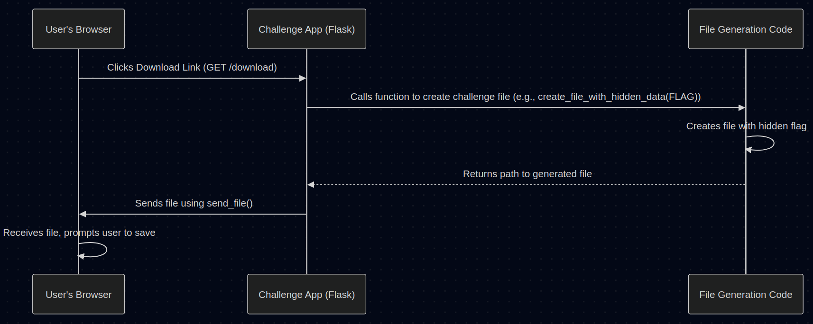

# Chapter 7: Forensic Challenge Techniques

Welcome back! In the previous chapter, [Admin Panel Logic](06_admin_panel_logic.md), we looked at how CTF organizers can manage the event using the admin dashboard. Now, let's switch back to the perspective of a player and dive into a specific *category* of challenges: **Forensics**.

## What Problem Do Forensics Challenges Solve? The Hunt for Hidden Data!

Imagine you're a digital detective. Someone has hidden a secret message (the flag!) inside a computer file, and it's your job to find it. Forensic challenges test your skills in uncovering data that isn't immediately obvious.

These challenges often give you a file – maybe an image, a document, a data dump, or a recording of network activity – and the flag is concealed within it using various tricks.

**Analogy: The Puzzle Box Collection**

Think of forensic techniques like different types of puzzle boxes:
*   Some boxes look simple, but you need to examine them *very* closely, perhaps noticing a tiny, almost invisible seam (like **Steganography**).
*   Some boxes seem to be one thing (like a wooden block), but they actually contain other items hidden inside if you know how to break them open correctly (like **File Carving**).
*   Some "boxes" are recordings of conversations, and you need to listen carefully (or use special tools) to pick out the secret codeword mentioned (like **PCAP Analysis**).

Each type requires a different approach or tool to unlock the secret flag hidden inside. Let's explore a few common techniques!

## Technique 1: Steganography - Hiding in Plain Sight

Steganography is the art and science of hiding secret messages within other, non-secret messages or files. In CTFs, this often means hiding data within an image file.

**How it Works: Least Significant Bit (LSB)**

One very common technique is Least Significant Bit (LSB) steganography. Digital images are made of pixels, and each pixel has a color value (often represented by numbers for Red, Green, and Blue - RGB). These numbers are stored in binary (1s and 0s).

LSB steganography works by changing the *very last* bit (the "least significant" one) of these color numbers. Changing the last bit makes such a tiny difference to the color that it's usually invisible to the human eye. But, you can use these tiny changes across many pixels to encode a hidden message!

**Analogy: The Tiny Whisper in a Loud Song**

Imagine a song playing loudly. You could whisper a secret message *very* quietly underneath the music. Someone just listening normally wouldn't notice the whisper, but someone with special equipment (or who knows *exactly* what to listen for) could isolate and hear the secret message. LSB changes are like those tiny whispers hidden in the "loud" color data of the image.

**Example Challenge (`forensics-stego`)**

Our `forensics-stego` challenge uses this technique. The Python code in `challenges/forensics-stego/challenge.py` (specifically the `hide_flag_in_image` function) does the following:
1.  Creates a normal-looking image (like a colorful gradient).
2.  Takes the secret `FLAG`.
3.  Converts the flag into a sequence of 1s and 0s.
4.  Goes through the image pixels one by one.
5.  For each pixel, it takes the Red color value and changes its *last* binary digit to match the next bit of the secret flag.
6.  Saves this slightly modified image.

To the naked eye, the image looks perfectly normal, but the flag is encoded in those tiny color changes.

**How to Solve It?**

You need a tool that can read these LSBs. Popular tools include:
*   `zsteg`: A command-line tool specifically for detecting and extracting steganography in PNG and BMP files. (`zsteg stego_image.png`)
*   `stegsolve`: A graphical tool that provides various filters to analyze images, including LSB extraction.
*   Online LSB tools: Many websites allow you to upload an image and extract LSB data.

You would download the image from the challenge, run it through one of these tools, and look for extracted text that resembles the flag format.

## Technique 2: File Carving - Digging Through Data

Sometimes, a challenge file isn't hiding data subtly; it's hiding entire files or file fragments *inside* itself! File carving is the process of finding and extracting these embedded files or data structures from a larger data blob.

**How it Works: Signatures and Strings**

Files often start with specific sequences of bytes called "magic numbers" or file signatures (e.g., JPEGs often start with `FF D8 FF`, PDFs with `%PDF-`). File carving tools can scan a file looking for these signatures to identify potential embedded files.

Alternatively, sometimes the flag itself is just hidden as plain text somewhere within a large binary file.

**Analogy: Message Scroll in a Loaf of Bread**

Imagine receiving a loaf of bread. It looks like normal bread, but if you slice it open or feel around inside, you might find a rolled-up scroll containing a secret message. File carving is like searching through the "bread" (the main file) for hidden "scrolls" (embedded files or the flag text).

**Example Challenge (`forensics-carving`)**

The `forensics-carving` challenge demonstrates this. The `create_file_with_hidden_data` function in `challenges/forensics-carving/challenge.py` builds a file by:
1.  Starting with a JPEG header (`FF D8...`).
2.  Adding some random data.
3.  Adding a PDF header (`%PDF-...`).
4.  Adding more random data.
5.  **Embedding the flag directly as text (e.g., `FLAG: flag{the_secret_is_here}`).**
6.  Adding more random data.
7.  Adding a ZIP header (`PK...`).
8.  Adding final random data.

The resulting file looks like a jumble of data, but it contains recognizable parts of other file types and the flag itself.

**How to Solve It?**

*   **Hex Editor:** Open the file in a hex editor (like `hexed.it`, HxD, Bless). You can visually scan the raw bytes or search for text strings like "flag", "FLAG", or parts of the expected flag format (e.g., "flag{").
*   **`strings` command:** A command-line tool that extracts readable text strings from binary files. (`strings forensic_challenge.dat`)
*   **`binwalk`:** A powerful command-line tool designed to scan binary files for embedded file signatures and extract them. (`binwalk -e forensic_challenge.dat`)

You would download the file, run these tools, and examine their output for recognizable file types or the flag text itself.

## Technique 3: PCAP Analysis - Eavesdropping on Networks

Network traffic is full of information. Sometimes, flags are hidden within recorded network conversations, saved in files typically ending with `.pcap` or `.pcapng`. PCAP analysis involves examining these captured packets to find the flag.

**How it Works: Finding Data in Packets**

The flag might be:
*   Sent in plain text within a protocol like HTTP, FTP, or DNS.
*   Hidden in unusual packet fields.
*   Transmitted as part of a file being downloaded.
*   Encoded within the traffic patterns themselves.

**Analogy: Listening to Recorded Calls**

Imagine you have recordings of phone calls. You need to listen to them (or use software to analyze them) to find a specific secret code word that was mentioned during one of the conversations. Analyzing a PCAP file is like reviewing those recorded calls (network packets) to find the hidden secret (the flag).

**Example Challenge (`forensics-pcap`)**

Our `forensics-pcap` challenge creates a very simple PCAP file. The `create_simple_pcap_file` function in `challenges/forensics-pcap/challenge.py` essentially creates a fake network packet representing an HTTP response that contains the flag in its body:
1.  Writes a standard PCAP file header.
2.  Writes a packet header.
3.  Writes packet data simulating an HTTP response, like: `HTTP/1.1 200 OK ... <html><body>Secret flag: flag{network_secrets}</body></html>`.

**How to Solve It?**

*   **`Wireshark`:** The most popular graphical tool for analyzing PCAP files. You can open the file, filter traffic (e.g., show only HTTP), follow TCP streams, and inspect the raw data of individual packets.
*   **`tcpdump` / `tshark`:** Command-line tools for capturing and analyzing traffic. You can use them to filter packets or extract specific information. (`tshark -r network_capture.pcap -Y http -T fields -e http.file_data`)

You would download the PCAP file, open it in Wireshark, likely filter for interesting protocols like HTTP, and examine the content of the packets until you find the flag.

## How Challenges Provide These Files

Remember our [Challenge Application](01_challenge_application.md)? It's the mini-website (built with [Flask Web Framework](04_flask_web_framework.md)) that presents the challenge. For forensic challenges, it needs to provide the file containing the hidden flag.

This usually involves:
1.  A function that *generates* the specific challenge file on-the-fly (like `create_file_with_hidden_data` or `hide_flag_in_image`), embedding the unique `FLAG` read from environment variables ([Flag Management](03_flag_management.md)).
2.  A Flask route (e.g., `/download` or `/image`) that triggers this file generation.
3.  Using Flask's `send_file` function to send the generated file to the user's browser, prompting a download.

**Simplified Flow: Downloading a Forensic File**

<p align="center">
    
</p>


**Simplified Flask Code Snippet (from `forensics-carving`)**

```python
# Simplified from challenges/forensics-carving/challenge.py

# [...] Imports and app setup

FLAG = os.environ.get('CTF_FLAG', 'default_flag')
TEMP_DIR = tempfile.mkdtemp() # Place to store generated file

# --- This function creates the file ---
def create_file_with_hidden_data(flag):
    file_path = os.path.join(TEMP_DIR, "challenge.dat")
    # (Code to write headers, random data, and the flag to file_path)
    print(f"Generated file at {file_path} with flag {flag}")
    return file_path
# --- End of function ---

# Route for downloading the file
@app.route('/download')
def download_file():
    # 1. Generate the unique file for this request
    file_path = create_file_with_hidden_data(FLAG)
    
    # 2. Send the generated file to the user
    return send_file(
        file_path,              # Path to the file
        as_attachment=True,     # Make browser prompt download
        download_name="forensic_challenge.dat" # Suggested filename
    )

# [...] Other routes ('/', '/check') and app run code
```

This pattern ensures each player gets a file with the correct flag hidden inside using the specific technique for that challenge.

## Conclusion

Forensic challenges are a fun and common part of CTFs, requiring you to act like a digital detective. You've learned about three common techniques:

1.  **Steganography (LSB):** Hiding data in the tiny details (least significant bits) of files like images. Requires tools like `zsteg` or `stegsolve`.
2.  **File Carving:** Extracting embedded files or plain text strings from within a larger data file. Uses hex editors, `strings`, or `binwalk`.
3.  **PCAP Analysis:** Finding flags hidden in recorded network traffic. Requires tools like `Wireshark` or `tshark`.

Understanding these techniques helps you know what to look for and which tools to use when faced with a forensics challenge file. Each challenge is a puzzle, and these are some of the keys to unlocking them!

This chapter concludes our overview of the core concepts behind building the `CTF_Project_Course` platform and some common challenge types. We hope this series has given you a solid foundation for understanding how CTF platforms work and how individual challenges are constructed and solved! Good luck with your future CTF adventures!

