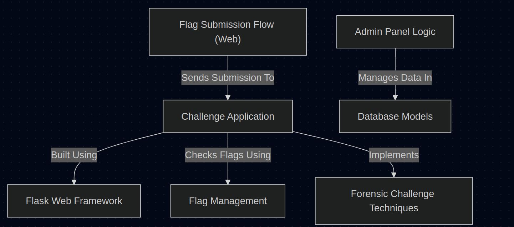

# Tutorial: CTF_Project_Course

This project creates a **Capture The Flag (CTF)** platform where users solve various security challenges.
Each *challenge* is a small, independent **Flask** web application that presents a puzzle and requires finding a secret *flag*.
The system manages these flags, checks user submissions, uses a *database* to store information (like users and scores), and provides an **Admin Panel** for overseeing the competition.

**Source Repository:** [https://github.com/deus1704/CTF_Project_Course](https://github.com/deus1704/CTF_Project_Course)

    

## Chapters

1. [Challenge Application](01_challenge_application.md)
2. [Flag Submission Flow (Web)](02_flag_submission_flow__web_.md)
3. [Flag Management](03_flag_management.md)
4. [Flask Web Framework](04_flask_web_framework.md)
5. [Database Models](05_database_models.md)
6. [Admin Panel Logic](06_admin_panel_logic.md)
7. [Forensic Challenge Techniques](07_forensic_challenge_techniques.md)

